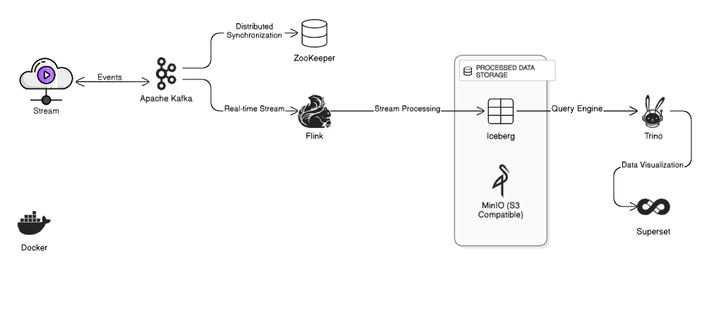

# 🌊 **STREAMWAVE** - Real-Time Data Pipeline Symphony 🎭

<div align="center">


### *Where Data Flows Like Water, Insights Bloom Like Fire* 🔥

```ascii
     ╔═══════════════════════════════════════════╗
     ║  🎪 Welcome to the Data Circus 🎪         ║
     ║  Where Streams Dance & Queries Sing       ║
     ╚═══════════════════════════════════════════╝
```

[**🚀 Launch**](#-ignition-sequence) • [**🎨 Architecture**](#-the-grand-design) • [**💫 Features**](#-cosmic-features) • [**🛸 Demo**](#-take-it-for-a-spin)

</div>

---

## 🎯 **Mission Control**

> *"In the realm of real-time data, we don't just process streams—we orchestrate symphonies."*

### 🌟 **What's This Magic?**

Picture this: **Clickstreams** flowing like digital rivers 🌊, captured by **Kafka's nets** 🕸️, transformed by **Flink's alchemy** ⚗️, stored in **Iceberg's crystal caves** 🏔️, queried by **Trino's lightning** ⚡, and visualized in **Superset's aurora** 🌌.

<details>
<summary>🎭 <b>The Cast of Characters</b> (Click to Reveal)</summary>

| 🎪 **Star** | 🎨 **Role** | 🌟 **Superpower** |
|-------------|-------------|-------------------|
| 🎤 **Kafka** | The Messenger | Captures every whisper of data |
| ⚡ **Flink** | The Transformer | Bends streams to its will |
| 🏔️ **Iceberg** | The Keeper | Guards data in time-frozen vaults |
| 🦅 **Trino** | The Seeker | Finds needles in data haystacks |
| 🎨 **Superset** | The Artist | Paints insights on digital canvas |
| 📦 **MinIO** | The Vault | S3's twin from another dimension |

</details>

---

## 🏗️ **The Grand Design**

<div align="center">

### 🎨 **The Blueprint**



### 🌊 **The Flow Symphony**


</div>

### 🎭 **Behind The Scenes**

<details>
<summary>🔍 <b>The Technical Orchestra</b> (Click to explore)</summary>

1. **🌊 Event Stream Generation**
   - Your digital footprints become data streams
   - Kafka captures every click, every move
   
2. **⚡ Real-time Transformation**
   - Flink works its magic in milliseconds
   - Raw streams become refined insights
   
3. **❄️ Data Preservation**
   - Iceberg freezes your data in time
   - MinIO provides the S3-compatible vault
   
4. **🦅 Lightning-Fast Queries**
   - Trino soars through petabytes
   - SQL at the speed of thought
   
5. **🎨 Visual Storytelling**
   - Superset paints your data story
   - Interactive dashboards come alive

</details>

### 🎪 **The Data Circus Layout**

```bash
🎪 streamwave/
├── 🎭 docker-compose.yml    # The ringmaster's script
├── ⚡ flink/                # The transformer's lair
│   └── 🔮 clickstream-filtering.sql
├── 🎮 producer/             # The event factory
│   └── 🎲 faker_generator.py
├── 📊 superset/             # The visualization studio
│   └── 🎨 dashboards/
└── 🦅 trino/                # The query engine's nest
    └── 🔍 catalog/
```

---

## 🚀 **Ignition Sequence**

### 🎬 **Act I: The Awakening**

```bash
# 🧬 Clone the magic repository
git clone https://github.com/Rooky-E/CryptoRift.git
cd streamwave

# 🎪 Raise the curtain (Start all services)
docker-compose up -d

# 🎭 Watch the show begin!
docker-compose logs -f
```

### 🎪 **Act II: The Portal Gates**

<div align="center">

| 🌐 **Portal** | 🔗 **Gateway** | 🗝️ **Secret Words** |
|---------------|----------------|---------------------|
| 📡 **Kafka HQ** | [localhost:9021](http://localhost:9021) | `🔓 Open Sesame` |
| ⚡ **Flink Lab** | [localhost:18081](http://localhost:18081) | `🔓 Public Access` |
| 📦 **MinIO Vault** | [localhost:9001](http://localhost:9001) | `🔐 admin/password` |
| 🦅 **Trino Nest** | [localhost:8080](http://localhost:8080) | `🔓 Fly Free` |
| 🎨 **Superset Studio** | [localhost:8088](http://localhost:8088) | `🔐 admin/admin` |

</div>

---

## 💫 **Cosmic Features**

### 🌊 **Stream Generation Magic**

<details>
<summary>🎲 <b>The Event Factory</b> (Expand to see the recipe)</summary>

```python
# 🎪 The Digital DNA of Each Event
{
    "event_id": "✨ Unique cosmic identifier",
    "user_id": "👤 Digital soul signature",
    "event_type": "🎭 page_view | 🛒 add_to_cart | 💰 purchase | 🚪 logout",
    "url": "🌐 Path through the web cosmos",
    "device": "📱 mobile | 💻 desktop | 📋 tablet",
    "timestamp": "⏰ Moment frozen in time",
    "geo_location": {
        "lat": "🌍 Earthly coordinates",
        "lon": "🗺️ Where magic happens"
    },
    "purchase_amount": "💎 Optional treasure value"
}
```

</details>

### ⚡ **Flink's Transformation Chamber**

```sql
-- 🔮 The Alchemy Script
CREATE TABLE clickstream_source (
    event_id STRING,
    user_id STRING,
    event_type STRING,
    -- ... more mystical fields ...
) WITH (
    'connector' = 'kafka',
    'topic' = 'clickstream',
    'properties.bootstrap.servers' = 'kafka:9092',
    'format' = 'json'
);

-- 🌟 Transform and Enlighten!
INSERT INTO iceberg.db.clickstream_sink
SELECT * FROM clickstream_source
WHERE event_type IN ('purchase', 'add_to_cart')
  AND purchase_amount > 0;
```

### 🏔️ **Iceberg's Time Capsules**

```bash
# 🔍 Peek into the frozen vaults
docker exec mc bash -c "mc ls -r minio/warehouse/"

# ❄️ Time travel capabilities enabled!
# 🔄 Schema evolution supported!
# 🎯 Partition pruning optimized!
```

### 🦅 **Trino's Lightning Queries**

```sql
-- 🎯 Summon the data spirits
USE iceberg.db;

-- 💎 Find the treasure hunters
SELECT 
    user_id as treasure_hunter,
    COUNT(*) as quest_count,
    SUM(purchase_amount) as total_loot
FROM clickstream_sink
WHERE event_type = 'purchase'
GROUP BY user_id
ORDER BY total_loot DESC
LIMIT 10;
```

---

## 🛸 **Take It For A Spin**

### 🎮 **Quick Play Commands**

<div align="center">

| 🎯 **Mission** | 🚀 **Command** | 🎪 **What Happens** |
|----------------|----------------|---------------------|
| 🎬 **Start Show** | `docker-compose up -d` | All systems go! |
| 🛑 **End Show** | `docker-compose down` | Curtains close |
| 🔍 **Watch Logs** | `docker-compose logs -f` | Behind the scenes |
| 🔄 **Restart Act** | `docker-compose restart` | Fresh performance |
| 💾 **Check Storage** | `docker exec mc mc ls minio/` | Peek in the vault |

</div>

---

## 🌟 **Advanced Sorcery**

### 🔮 **Performance Tuning Spells**

```yaml
# 🎪 Flink Memory Magic
flink:
  environment:
    - FLINK_PROPERTIES=
      jobmanager.memory.process.size: 2048m
      taskmanager.memory.process.size: 4096m
      state.backend: rocksdb
      state.checkpoints.dir: s3://minio:9000/checkpoints
```

### 🎨 **Superset Dashboard Wizardry**

1. **🌐 Connect to Trino:**
   ```
   trino://trino@trino:8080/iceberg/db
   ```

2. **📊 Create Magic Charts:**
   - 🌊 Real-time event flow
   - 💰 Revenue streams
   - 🗺️ Geo-heatmaps
   - 📈 Conversion funnels

---

## 🚀 **Future Dimensions**

<div align="center">

```
🔮 Coming Soon to a Container Near You 🔮
```

| 🌟 **Feature** | 🎯 **Status** | 🚀 **ETA** |
|----------------|---------------|------------|
| 🤖 **ML Pipeline** | 🔄 In Progress | Q2 2025 |
| 📊 **Grafana Monitoring** | 📝 Planned | Q3 2025 |
| 🔔 **Smart Alerts** | 💭 Ideation | Q3 2025 |
| 🌐 **Multi-Cloud** | 🧪 Research | Q4 2025 |

</div>

---

## 🤝 **Join The Revolution**

<div align="center">

### 🌟 **Contribution Rituals**

```bash
# 🍴 Fork the universe
# 🌿 Create your feature dimension
git checkout -b feature/amazing-feature

# 💫 Commit your magic
git commit -m '✨ Add some amazing feature'

# 🚀 Push to the cosmos
git push origin feature/amazing-feature

# 🎯 Open a portal (PR)
```

### 👨‍🚀 **The Architect**

<div align="center">

**🚀 Created by [Rooky-E](https://github.com/Rooky-E) 🚀**

*Chief Data Wizard & Stream Conductor*
</div>

> *Join me in building the future of real-time data!*

</div>

---

## 📜 **Sacred Scrolls**

<div align="center">

📖 **Licensed under the MIT Spell** 📖

*May your streams flow eternal and your queries return swift*

---

### 🌟 **Final Incantation**

```
╔══════════════════════════════════════════════════════╗
║  "In data we trust, in streams we thrive,           ║
║   With pipelines strong, insights come alive!"       ║
║                                                      ║
║  🌊 Happy Streaming! 🚀                              ║
╚══════════════════════════════════════════════════════╝
```

**Built with 💙 by Data Dreamers | Powered by ☕ and 🎵**

[⬆️ **Back to the Stars**](#-streamwave---real-time-data-pipeline-symphony-)

</div>
