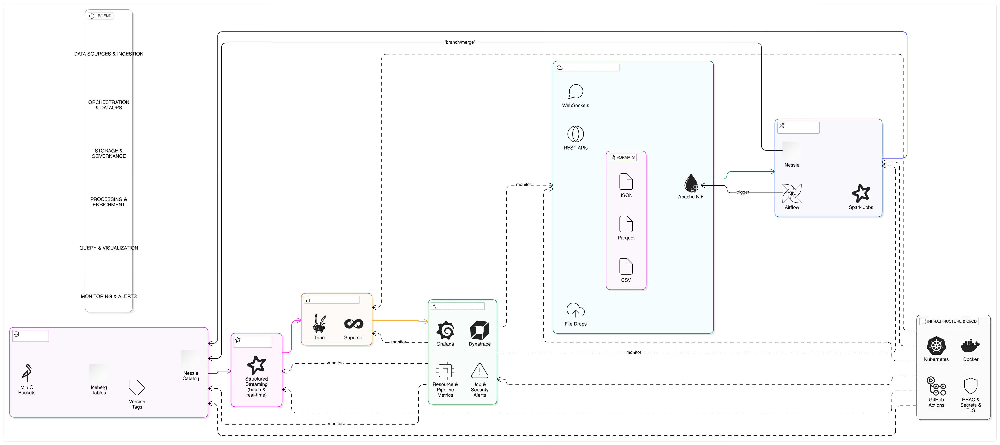

  <b>CryptoRift</b>, <i>une plateforme on-premise “Data Lakehouse” dédiée aux données blockchain et crypto-actifs.</i>

------------

CryptoRift
==========

**Une plateforme on-premise de type Lakehouse pour la donnée blockchain et crypto-actifs**

**CryptoRift** unifie l’historique massif (To–Po) et les flux en temps réel (centaines de milliers d’événements par seconde) de données crypto dans un seul pipeline ACID, évolutif et sécurisé, offrant :

*   **Ingestion unifiée** (batch + streaming)
    
*   **Stockage ACID** avec gouvernance et time-travel
    
*   **Traitement unique** pour batch & real-time
    
*   **Self-service analytics** via SQL et dashboards
    
*   **Autoscaling & sécurité** native Kubernetes
    

Table des matières
------------------

1.  [Vision & Contexte](#vision--contexte)
    
2.  [Objectifs Métier](#objectifs-métier)
    
3.  [Architecture Générale](#architecture-générale)
    
4.  [Description des Couches & Outils](#description-des-couches--outils)
    
5.  [Flux de Données](#flux-de-données)
    
6.  [Mise en Route (sans scripts)](#mise-en-route-sans-scripts)
    
7.  [Sécurité & Gouvernance](#sécurité---gouvernance)
    
8.  [Opérations & Scalabilité](#opérations---scalabilité)
    
9.  [Surveillance & Performances](#surveillance---performances)
    
10.  [Contribuer](#contribuer)
    
11.  [Licence](#licence)
    

Vision & Contexte
-----------------

Dans le monde crypto, les équipes font face à :

*   **Volumes massifs** d’archives blockchain (To–Po)
    
*   **Flux ultra-rapides** de trades et d’états de contrat
    
*   **Besoins de compliance** (KYC/AML, audit)
    
*   **Coûts cloud croissants** et dépendance à des fournisseurs SaaS
    

**CryptoRift** résout ces défis en apportant une solution sur site, 100 % open source, capable de traiter à la fois des jeux de données historiques et des flux en temps réel, tout en garantissant traçabilité, performance et sécurité.

Objectifs Métier
----------------

*   **Réduire la fragmentation** des sources de données
    
*   **Garantir la traçabilité** et l’auditabilité à chaque étape
    
*   **Limiter les coûts** en exploitant nos propres serveurs
    
*   **Offrir une expérience self-service** pour les analystes
    
*   **Automatiser** la mise à l’échelle et les déploiements
    
*   **Surveiller en continu** la santé de la plateforme
    

Architecture Générale
---------------------

1.  **Ingestion** – Collecte batch & streaming
    
2.  **Orchestration & DataOps** – Planification, versioning
    
3.  **Stockage & Gouvernance** – Object store ACID, time-travel
    
4.  **Traitement & Enrichissement** – Moteur unifié batch/stream
    
5.  **Requêtage & BI** – SQL distribué + dashboards
    
6.  **Surveillance & Alertes** – Métriques, traces, alerting
    
7.  **Infrastructure & CI/CD** – Kubernetes, containers, pipelines
    

Chaque couche communique via des flux bien définis et s’intègre nativement au reste de l’écosystème.

Description des Couches & Outils
--------------------------------

### 1\. Ingestion

*   **Sources** : REST APIs, WebSockets (exchanges), fichiers CSV/Parquet
    
*   **Outil** : **Apache NiFi** — pipelines drag-and-drop pour ingestion planifiée et continue, avec back-pressure et traçabilité intégrée.
    

### 2\. Orchestration & DataOps

*   **Planification** : **Apache Airflow** — DAGs Python pour enchaîner ingestion, validation et calculs.
    
*   **Versioning** : **Project Nessie** — système Git-style pour versionner et gérer les branches des tables Iceberg.
    

### 3\. Stockage & Gouvernance

*   **Object Store** : **MinIO** — S3-compatible sur site pour raw/curated data.
    
*   **Table Format** : **Apache Iceberg** — tables ACID, time-travel, schema evolution.
    

### 4\. Traitement & Enrichissement

*   **Moteur** : **Spark Structured Streaming** — unique API pour traitements par lots et flux, checkpointing exactly-once.
    

### 5\. Requêtage & BI

*   **SQL distribué** : **Trino** — exposer les tables Iceberg pour ad-hoc queries.
    
*   **Dashboards** : **Apache Superset** ou **Metabase** — création de graphiques et rapports via interface visuelle.
    

### 6\. Surveillance & Alertes

*   **Métriques** : **Prometheus + Grafana** — collecte des métriques des services et dashboards interactifs.
    
*   **APM** : **Dynatrace** — auto-instrumentation et détection d’anomalies AI-driven.
    

### 7\. Infrastructure & CI/CD

*   **Orchestration conteneurs** : **Kubernetes (K3s) + Docker** — déploiement, mise à l’échelle, résilience.
    
*   **CI/CD** : **GitHub Actions** — pipelines build-test-deploy en continu.
    

Flux de Données
---------------

1.  **NiFi** ingère et transforme en un format unifié (Parquet, JSON).
    
2.  **Airflow** orchestre les appels NiFi et déclenche les jobs Spark.
    
3.  **MinIO/Iceberg** stocke raw et curated data avec versioning Nessie.
    
4.  **Spark** traite les données batch et streaming, écrit les résultats en Iceberg.
    
5.  **Trino** sert les résultats via SQL ; **Superset/Metabase** produit les dashboards.
    
6.  **Prometheus/Grafana** et **Dynatrace** surveillent les métriques et alertes.
    

Mise en Route (sans scripts)
----------------------------

1.  Préparer un serveur Linux (8 Go RAM, ~500 Go de disque).
    
2.  Installer Docker CE puis K3s (distribution légère de Kubernetes).
    
3.  Déployer les composants via Helm ou manifests Kubernetes pour chaque couche :
    
    *   NiFi, Airflow, Nessie
        
    *   MinIO et Iceberg
        
    *   Spark et Trino
        
    *   Superset/Metabase
        
    *   Prometheus, Grafana, Dynatrace agent
        
4.  Configurer les connexions entre composants (catalogue Iceberg, endpoints NiFi, etc.).
    
5.  Valider l’ingestion, le traitement, le requêtage et l’affichage dans les dashboards.
    

Sécurité & Gouvernance
----------------------

*   **RBAC Kubernetes** : rôles et bindings pour restreindre l’accès service par service.
    
*   **Secrets Kubernetes** : stockage chiffré des clés d’API et certificats.
    
*   **TLS** : chiffrement des communications internes via cert-manager.
    
*   **Provenance** : NiFi enregistre chaque étape de transformation pour audit complet.
    

Opérations & Scalabilité
------------------------

*   **Autoscaling** : HPA/VPA/KEDA pour adapter dynamiquement le nombre de pods selon la charge réelle.
    
*   **GitOps** : Flux/Argo CD pour synchroniser automatiquement la configuration Kubernetes depuis votre dépôt.
    
*   **CI/CD automatisé** : tout changement de code ou de pipeline déclenche un build et un déploiement sans intervention manuelle.
    

Surveillance & Performances
---------------------------

*   **Benchmarks** : mesurer débit NiFi (FlowFiles/s), IO MinIO, latence de commit Iceberg, throughput Spark, temps de réponses Trino.
    
*   **Tuning automatisé** : utiliser les recommandations VPA et ajuster via GitOps les seuils HPA.
    
*   **Dashboards de santé** : workflows, ressources, jobs et alertes visibles en continu.
    

Contribuer
----------

1.  Créer un fork du projet.
    
2.  Ouvrir une branche feature/ma-fonctionnalité.
    
3.  Mettre à jour la documentation et ajouter des tests.
    
4.  Soumettre une Pull Request pour revue.
    

Licence
-------

Sous licence **Apache 2.0**. Voir le fichier **LICENSE** pour plus de détails.
