# 🌊 **STREAMWAVE** - Real-Time Data Pipeline Symphony 🎭

<div align="center">


### *Where Data Flows Like Water, Insights Bloom Like Fire* 🔥

<p align="center">
  
</p>

```ascii
            ╔═══════════════════════════════════════════╗
            ║       🎪 Welcome to the Data Circus 🎪    ║
            ║    Where Streams Dance & Queries Sing     ║
            ╚═══════════════════════════════════════════╝
```

[**🚀 Launch**](#-ignition-sequence) • [**🎨 Architecture**](#-the-grand-design) • [**💫 Features**](#-cosmic-features) • [**🛸 Demo**](#-take-it-for-a-spin)

</div>

---

## 🎯 **Mission Control**

<div align="center">

```
┌─────────────────────────────────────────────────────────────────┐
│                    🎯 MISSION BRIEFING 🎯                       │
├─────────────────────────────────────────────────────────────────┤
│  ▸ OBJECTIVE: Master Real-Time Data Streaming                  │
│  ▸ DIFFICULTY: ████████░░ 80% (Expert)                        │
│  ▸ TIME TO DEPLOY: ⏱️  5 Minutes                               │
│  ▸ REWARD: ∞ Streaming Capabilities                            │
└─────────────────────────────────────────────────────────────────┘
```

</div>

> *"In the realm of real-time data, we don't just process streams—we orchestrate symphonies."*

### 🌟 **What's This Magic?**

Picture this: **Clickstreams** flowing like digital rivers 🌊, captured by **Kafka's nets** 🕸️, transformed by **Flink's alchemy** ⚗️, stored in **Iceberg's crystal caves** 🏔️, queried by **Trino's lightning** ⚡, and visualized in **Superset's aurora** 🌌.

<details>
<summary>🎭 <b>The Cast of Characters</b> (Click to Reveal)</summary>

| 🎪 **Star** | 🎨 **Role** | 🌟 **Superpower** |
|-------------|-------------|-------------------|
| 🎤 **Kafka** | The Messenger | Captures every whisper of data |
| ⚡ **Flink** | The Transformer | Bends streams to its will |
| 🏔️ **Iceberg** | The Keeper | Guards data in time-frozen vaults |
| 🦅 **Trino** | The Seeker | Finds needles in data haystacks |
| 🎨 **Superset** | The Artist | Paints insights on digital canvas |
| 📦 **MinIO** | The Vault | S3's twin from another dimension |

</details>

---

## 🏗️ **The Grand Design**

<div align="center">

### 🎨 **The Blueprint**


### 🌊 **The Flow Symphony**

```mermaid
graph LR
    A[🎮 Click Generator] -->|🌊 Streams| B[📡 Kafka]
    B -->|⚡ Processes| C[🔮 Flink]
    C -->|❄️ Freezes| D[🏔️ Iceberg/MinIO]
    D -->|🔍 Queries| E[🦅 Trino]
    E -->|🎨 Visualizes| F[📊 Superset]
    
    style A fill:#ff6b6b,stroke:#c92a2a,color:#fff
    style B fill:#4ecdc4,stroke:#099268,color:#fff
    style C fill:#ffe66d,stroke:#fcc419,color:#000
    style D fill:#a8e6cf,stroke:#51cf66,color:#000
    style E fill:#ff8b94,stroke:#ff6b6b,color:#fff
    style F fill:#c7ceea,stroke:#9775fa,color:#000
```



</div>

### 🎭 **Behind The Scenes**

<details>
<summary>🔍 <b>The Technical Orchestra</b> (Click to explore)</summary>

1. **🌊 Event Stream Generation**
   - Your digital footprints become data streams
   - Kafka captures every click, every move
   
2. **⚡ Real-time Transformation**
   - Flink works its magic in milliseconds
   - Raw streams become refined insights
   
3. **❄️ Data Preservation**
   - Iceberg freezes your data in time
   - MinIO provides the S3-compatible vault
   
4. **🦅 Lightning-Fast Queries**
   - Trino soars through petabytes
   - SQL at the speed of thought
   
5. **🎨 Visual Storytelling**
   - Superset paints your data story
   - Interactive dashboards come alive

</details>

### 🎪 **The Data Circus Layout**

```bash
🎪 streamwave/
├── 🎭 docker-compose.yml    # The ringmaster's script
├── ⚡ flink/                # The transformer's lair
│   └── 🔮 clickstream-filtering.sql
├── 🎮 producer/             # The event factory
│   └── 🎲 faker_generator.py
├── 📊 superset/             # The visualization studio
│   └── 🎨 dashboards/
└── 🦅 trino/                # The query engine's nest
    └── 🔍 catalog/
```

---

## 🚀 **Ignition Sequence**

### 🎬 **Act I: The Awakening**

<div align="center">

```bash
      ╭──────────────────────────────────────────╮
      │   🧬 Clone the magic repository          │
      ╰──────────────────────────────────────────╯
              ⬇️
git clone git@github.com:Rooky-E/streamwave.git
cd streamwave
              ⬇️
      ╭──────────────────────────────────────────╮
      │   🎪 Raise the curtain (Start services)  │
      ╰──────────────────────────────────────────╯
              ⬇️
docker-compose up -d
              ⬇️
      ╭──────────────────────────────────────────╮
      │   🎭 Watch the show begin!               │
      ╰──────────────────────────────────────────╯
              ⬇️
docker-compose logs -f
```

</div>

### 🎪 **Act II: The Portal Gates**

<div align="center">

```
╔═══════════════════════════════════════════════════════════════════════╗
║                        🌐 PORTAL DIRECTORY 🌐                         ║
╠═══════════════════════════════════════════════════════════════════════╣
║                                                                       ║
║   📡 Kafka HQ........... http://localhost:9021 ...... [🔓 OPEN]     ║
║   ⚡ Flink Lab.......... http://localhost:18081 ..... [🔓 OPEN]     ║
║   📦 MinIO Vault........ http://localhost:9001 ...... [🔐 SECURED]  ║
║   🦅 Trino Nest......... http://localhost:8080 ...... [🔓 OPEN]     ║
║   🎨 Superset Studio.... http://localhost:8088 ...... [🔐 SECURED]  ║
║                                                                       ║
╚═══════════════════════════════════════════════════════════════════════╝

                         🗝️ Secret Credentials 🗝️
                    MinIO: admin/password | Superset: admin/admin
```

</div>

---

## 💫 **Cosmic Features**

### 🌊 **Stream Generation Magic**

<details>
<summary>🎲 <b>The Event Factory</b> (Expand to see the recipe)</summary>

```python
# 🎪 The Digital DNA of Each Event
{
    "event_id": "✨ Unique cosmic identifier",
    "user_id": "👤 Digital soul signature",
    "event_type": "🎭 page_view | 🛒 add_to_cart | 💰 purchase | 🚪 logout",
    "url": "🌐 Path through the web cosmos",
    "device": "📱 mobile | 💻 desktop | 📋 tablet",
    "timestamp": "⏰ Moment frozen in time",
    "geo_location": {
        "lat": "🌍 Earthly coordinates",
        "lon": "🗺️ Where magic happens"
    },
    "purchase_amount": "💎 Optional treasure value"
}
```

</details>

### ⚡ **Flink's Transformation Chamber**

```sql
-- 🔮 The Alchemy Script
CREATE TABLE clickstream_source (
    event_id STRING,
    user_id STRING,
    event_type STRING,
    -- ... more mystical fields ...
) WITH (
    'connector' = 'kafka',
    'topic' = 'clickstream',
    'properties.bootstrap.servers' = 'kafka:9092',
    'format' = 'json'
);

-- 🌟 Transform and Enlighten!
INSERT INTO iceberg.db.clickstream_sink
SELECT * FROM clickstream_source
WHERE event_type IN ('purchase', 'add_to_cart')
  AND purchase_amount > 0;
```

### 🏔️ **Iceberg's Time Capsules**

```bash
# 🔍 Peek into the frozen vaults
docker exec mc bash -c "mc ls -r minio/warehouse/"

# ❄️ Time travel capabilities enabled!
# 🔄 Schema evolution supported!
# 🎯 Partition pruning optimized!
```

### 🦅 **Trino's Lightning Queries**

```sql
-- 🎯 Summon the data spirits
USE iceberg.db;

-- 💎 Find the treasure hunters
SELECT 
    user_id as treasure_hunter,
    COUNT(*) as quest_count,
    SUM(purchase_amount) as total_loot
FROM clickstream_sink
WHERE event_type = 'purchase'
GROUP BY user_id
ORDER BY total_loot DESC
LIMIT 10;
```

---

## 🛸 **Take It For A Spin**

### 🎮 **Quick Play Commands**

<div align="center">

```
┏━━━━━━━━━━━━━━━━━━━━━━━━━━━━━━━━━━━━━━━━━━━━━━━━━━━━━━━━━━━━━━━━━━┓
┃                       🎮 COMMAND CENTER 🎮                        ┃
┣━━━━━━━━━━━━━━━━━━━━━━━━━━━━━━━━━━━━━━━━━━━━━━━━━━━━━━━━━━━━━━━━━━┫
┃                                                                   ┃
┃  🎬 START SHOW     ▸ docker-compose up -d      [Launch all]      ┃
┃  🛑 END SHOW       ▸ docker-compose down       [Stop all]        ┃
┃  🔍 WATCH LOGS     ▸ docker-compose logs -f    [Live feed]       ┃
┃  🔄 RESTART ACT    ▸ docker-compose restart    [Fresh start]     ┃
┃  💾 CHECK STORAGE  ▸ docker exec mc mc ls minio/  [Peek vault]   ┃
┃  🎯 RUN DEMO       ▸ ./demo/scenarios/ecommerce-rush.sh         ┃
┃                                                                   ┃
┗━━━━━━━━━━━━━━━━━━━━━━━━━━━━━━━━━━━━━━━━━━━━━━━━━━━━━━━━━━━━━━━━━━┛
```

</div>

---

## 🌟 **Advanced Sorcery**

### 🔮 **Performance Tuning Spells**

```yaml
# 🎪 Flink Memory Magic
flink:
  environment:
    - FLINK_PROPERTIES=
      jobmanager.memory.process.size: 2048m
      taskmanager.memory.process.size: 4096m
      state.backend: rocksdb
      state.checkpoints.dir: s3://minio:9000/checkpoints
```

### 🎨 **Superset Dashboard Wizardry**

1. **🌐 Connect to Trino:**
   ```
   trino://trino@trino:8080/iceberg/db
   ```

2. **📊 Create Magic Charts:**
   - 🌊 Real-time event flow
   - 💰 Revenue streams
   - 🗺️ Geo-heatmaps
   - 📈 Conversion funnels

---

## 🚀 **Future Dimensions**

<div align="center">

```
╔══════════════════════════════════════════════════════════════════════╗
║                    🔮 ROADMAP TO THE STARS 🔮                       ║
╠══════════════════════════════════════════════════════════════════════╣
║                                                                      ║
║  Q2 2025  ┃  🤖 ML Pipeline         ┃  [████████░░] 80%            ║
║  Q3 2025  ┃  📊 Grafana Monitoring  ┃  [██████░░░░] 60%            ║
║  Q3 2025  ┃  🔔 Smart Alerts        ┃  [████░░░░░░] 40%            ║
║  Q4 2025  ┃  🌐 Multi-Cloud         ┃  [██░░░░░░░░] 20%            ║
║                                                                      ║
║            ⚡ VELOCITY: Warp Speed | 🎯 TARGET: The Future          ║
╚══════════════════════════════════════════════════════════════════════╝
```

</div>

---

## 🤝 **Join The Revolution**

<div align="center">

### 🌟 **Contribution Rituals**

```bash
# 🍴 Fork the universe
# 🌿 Create your feature dimension
git checkout -b feature/amazing-feature

# 💫 Commit your magic
git commit -m '✨ Add some amazing feature'

# 🚀 Push to the cosmos
git push origin feature/amazing-feature

# 🎯 Open a portal (PR)
```

### 👨‍🚀 **The Architect**

<div align="center">

**🚀 Created by [Rooky-E](https://github.com/Rooky-E) 🚀**

*Chief Data Wizard & Stream Conductor*
</div>

> *Join me in building the future of real-time data!*

</div>

---

## 📜 **Sacred Scrolls**

<div align="center">

📖 **Licensed under the MIT Spell** 📖

*May your streams flow eternal and your queries return swift*

---

### 🌟 **Final Incantation**

```
╔══════════════════════════════════════════════════════╗
║  "In data we trust, in streams we thrive,           ║
║   With pipelines strong, insights come alive!"       ║
║                                                      ║
║  🌊 Happy Streaming! 🚀                              ║
╚══════════════════════════════════════════════════════╝
```

**Built with 💙 by Data Dreamers | Powered by ☕ and 🎵**

[⬆️ **Back to the Stars**](#-streamwave---real-time-data-pipeline-symphony-)

</div>
